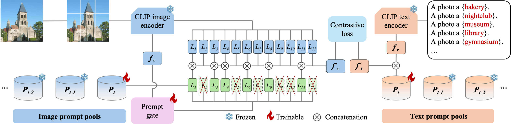

# IAP: Improving Continual Learning of Vision-Language Models via Instance-Aware Prompting
Implementation of [IAP: Improving Continual Learning of Vision-Language Models via Instance-Aware Prompting](https://arxiv.org/abs/2503.20612).
## Abstract
Recent pre-trained vision-language models (PT-VLMs) often face a Multi-Domain Class-Incremental Learning (MCIL) scenario in practice, where several classes and domains of multi-modal tasks are incrementally arrived. Without access to previously learned tasks and unseen tasks, memory-constrained MCIL suffers from forward and backward forgetting. To alleviate the above challenges, parameter-efficient fine-tuning techniques (PEFT), such as prompt tuning, are employed to adapt the PT-VLM to the diverse incrementally learned tasks. To achieve effective new task adaptation, existing methods only consider the effect of PEFT strategy selection, but neglect the influence of PEFT parameter setting (e.g., prompting). In this paper, we tackle the challenge of optimizing prompt designs for diverse tasks in MCIL and propose an Instance-Aware Prompting (IAP) framework. Specifically, our Instance-Aware Gated Prompting (IA-GP) module enhances adaptation to new tasks while mitigating forgetting by dynamically assigning prompts across transformer layers at the instance level. Our Instance-Aware Class-Distribution-Driven Prompting (IA-CDDP) improves the task adaptation process by determining an accurate task-label-related confidence score for each instance. Experimental evaluations across 11 datasets, using three performance metrics, demonstrate the effectiveness of our proposed method. 

## Introduction
(1) We design an Instance-Aware Gated Prompting strategy to address the challenge of determining where to prompt. We enhance PEFT techniques, enabling the model to dynamically allocate prompting positions at the instance level, thereby improving the models incremental learning capability. (2) We introduce Instance-Aware Class-Distribution-Driven Prompting to derive more reliable prompt weights. To enhance model performance across diverse instances, we employ a two-stage distribution modeling approach that operates at both the task and class levels during inference. (3) Extensive experiments on benchmark datasets demonstrate that our IAP method achieves state-of-the-art performance while utilizing only 1.18% of the training parameters, outperforming all existing approaches.

*Illustration of Instance-Aware Gated Prompting strategy. The figure illustrates the processing workflow of the IA-GP strategy applied to an instance "abbey". Initially, the image is segmented into patches, which are then fed into the visual encoder of the CLIP model. Simultaneously, corresponding textual category descriptions are processed by the textual encoder. The IA-GP strategy utilizes trainable prompt pools for both visual and textual modalities, while prompts from previously seen tasks are kept frozen. The strategy leverages the visual features from the original CLIP encoders, denoted as $f_v=F_v(x)$, as input of prompt gate module. Hard Gumbel logits produced by prompt gate modules are used to determine whether to retrieve prompts from prompt pools. $L$ denoted each self-attention layer in the Transformer architectures. Outputs from the original CLIP model are represented in blue, while those incorporating retrieved prompts via the IA-GP strategy are shown in green. The processed visual and textual features are optimized through a contrastive loss function.*

## Datasets
Please refer to [dataset.md](docs/datasets.md).

## Enviroments
Clone our repository:
```bash
git clone https://github.com/FerdinandZJU/IAP.git
```
Then create an environment and install dependencies:
```bash
pip install -r requirements.txt
``` 
If it is the first running, model can be downloaded automatically.

## Running
We provide three config files under `configs/`: `MTIL.yaml` and `MTIL-order-II.yaml`. For training, please run:
```bash
python main.py --config-path configs/MTIL.yaml --boundaries 0.8,0.2
``` 

## Acknowledgements
This code is initially based on [ZSCL](https://github.com/Thunderbeee/ZSCL), and some implementations are borrowed from [ZSCL](https://github.com/Thunderbeee/ZSCL). We thank their authors for releasing their code.
